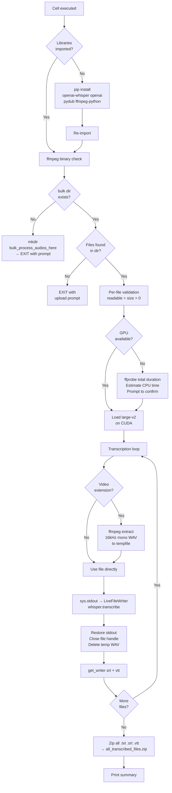

<div align="center">

# 🎙️ Whisper Bulk Transcriber

### Transcribe any audio or video file — for free — using Google Colab and OpenAI Whisper

[](https://colab.research.google.com/github/lilhawkeye2002-ux/notebooks/blob/main/Whisper_Bulk_Transcriber.ipynb)
&nbsp;

&nbsp;

&nbsp;


</div>

---

Drop your audio or video files into a folder and get back clean **`.txt`**, **`.srt`**, and **`.vtt`** transcripts — automatically, with no coding required.

Powered by OpenAI's [Whisper `large-v2`](https://github.com/openai/whisper) model, one of the most accurate open-source speech recognition systems available today.

---

## 📋 Contents

- [What This Does](#-what-this-does)
- [Beginner Tutorial — No coding needed](#-beginner-tutorial--no-coding-needed)
- [Programmer Tutorial — Technical deep dive](#-programmer-tutorial--technical-deep-dive)
- [Output Formats](#-output-formats)
- [Troubleshooting](#-troubleshooting)

---

## ✨ What This Does

| Feature | Detail |
|---|---|
| 🎧 **Audio transcription** | `.mp3` `.wav` `.m4a` `.flac` `.aac` `.ogg` `.wma` `.opus` `.aiff` `.amr` `.au` |
| 🎬 **Video transcription** | `.mp4` `.mov` `.avi` `.mkv` `.webm` — audio is extracted automatically |
| 📝 **Output formats** | Plain text `.txt`, subtitles `.srt`, web captions `.vtt` |
| 📦 **Bulk processing** | Transcribes an entire folder of files in one run |
| 🆓 **Completely free** | Runs on Google Colab's free T4 GPU |
| 🌏 **Multilingual** | Auto-detects language — tested with English, Japanese, and more |

### How Whisper Works

Whisper listens to audio and uses a deep learning model trained on 680,000 hours of multilingual audio to produce highly accurate transcriptions — even with accents, background noise, or technical vocabulary.


> *Whisper processes audio in 30-second chunks through an encoder-decoder Transformer. The `large-v2` model used here is the most accurate variant in the original release.*

---

## 🟢 Beginner Tutorial — No coding needed

> **You don't need to know Python.** Just follow these steps — the notebook does everything for you.

---

### Before you start

You need a free Google account. That's it.

Click the button below to open the notebook:

[](https://colab.research.google.com/github/lilhawkeye2002-ux/notebooks/blob/main/Whisper_Bulk_Transcriber.ipynb)

---

### Step 1 — Enable a free GPU

Transcription is *much* faster with a GPU. Do this first:

1. In the menu bar at the top, click **Runtime**
2. Click **Change runtime type**
3. Under **Hardware accelerator**, select **T4 GPU**
4. Click **Save**

> 💡 Google gives every account free access to a T4 GPU. It costs nothing.

---

### Step 2 — Run the cell for the first time

You'll see one large code cell in the notebook. Click the **▶ play button** on its left side (or click inside it and press `Shift + Enter`).

The cell will:
- Install all required software automatically (takes ~1 minute)
- Create an upload folder for your files
- Then stop and print a message like this:

```
Directory created: '/content/bulk_process_audios_here'
Upload your audio/video files there, then run this cell again.
```

---

### Step 3 — Upload your files

1. Look at the **left sidebar** and click the **folder icon** 📁 — this opens the Files panel
2. In the file tree, find and click the folder **`bulk_process_audios_here`**
3. **Drag and drop** your audio or video files from your computer into that folder

```
content/
└── bulk_process_audios_here/    ← drop your files here
      Interview.mp3
      Meeting_Recording.mp4
      Podcast_Ep42.wav
```

> ✅ You can upload as many files as you like at once — they'll all be processed in order.

> 🎬 Video files work too — the audio is extracted automatically before transcription.

---

### Step 4 — Run the cell again

Click **▶** one more time. The notebook will find your files and start transcribing.

**What you'll see:**

```
Found 3 file(s) to transcribe.
3 file(s) passed validation.
Loading 'large-v2' model on cuda...
Model 'large-v2' loaded on cuda.

[1/3] Processing: Interview.mp3
[00:00.000 --> 00:04.820]  Welcome everyone, today we're going to discuss...
[00:04.820 --> 00:09.110]  the topic of renewable energy and why it matters...
  Saved: Interview.txt
  Saved: Interview.srt
  Saved: Interview.vtt

[2/3] Processing: Meeting_Recording.mp4
  Video file detected — extracting audio track via ffmpeg...
  Audio extracted successfully.
[00:00.000 --> 00:03.500]  Okay so let's get started with the agenda...
```

The transcript appears **live on screen** as each line is recognised — you can watch it happen in real time.

---

### Step 5 — Download your results

When all files are done, a zip file is created automatically:

```
✓ Zipped 9 files → /content/all_transcribed_files.zip (1.24 MB)
REMINDER: Download your zip before the Colab session ends.
```

**To download:**

1. In the **Files panel** on the left, find `all_transcribed_files.zip` under `/content/`
2. **Right-click** it → click **Download**

> ⚠️ **Download before you close the tab.** Colab erases all files when the session ends — the zip cannot be recovered afterward.

---

### Final summary

At the very end, the notebook prints a report:

```
====================================================
TRANSCRIPTION SUMMARY
  Total files :  3
  Succeeded   :  3
  Failed      :  0
====================================================
```

If any file failed, it will be listed here with the reason.

---

## 🔵 Programmer Tutorial — Technical deep dive

This section covers the notebook's internal architecture, configuration knobs, and integration patterns for developers who want to understand or extend it.

---

### Architecture overview



---

### Key components

#### `LiveFileWriter`

A custom `sys.stdout` wrapper that tees Whisper's console output simultaneously to the terminal and a `.txt` file — with a **single persistent file handle** (opened once per file, not once per segment).

Segment detection uses a compiled regex anchored to Whisper's exact verbose output format, preventing false positives when transcribed speech contains ` --> `:

```python
_WHISPER_SEGMENT_RE = re.compile(
    r'^\[\d{2}:\d{2}\.\d{3} --> \d{2}:\d{2}\.\d{3}\]'
)
```

Only lines matching this pattern are written to `.txt`. Everything else (model loading logs, progress bars) stays console-only.

#### `_extract_audio_from_video()`

Shells out to `ffmpeg` to extract audio as **16 kHz mono PCM WAV** — Whisper's native internal format — which eliminates the re-decode step inside `whisper.load_audio()`:

```
ffmpeg -y -i input.mp4 -vn -acodec pcm_s16le -ar 16000 -ac 1 /tmp/_whisper_extract_XXXX.wav
```

The temp file path is stored in `_temp_audio` and unconditionally deleted in the `finally` block — even if transcription raises an exception.

#### Unicode normalisation

Output filenames are NFC-normalised before use:

```python
output_stem = unicodedata.normalize("NFC", raw_stem)
```

This matters for files uploaded from **macOS**, which uses NFD decomposition for filenames. Without normalisation, Japanese filenames and others can produce broken zip entries on Linux/Windows extraction.

---

### Whisper transcription options

The `_options` dict exposes the full Whisper API surface:

```python
_options = {
    "task": "transcribe",          # or "translate" to force English output
    "fp16": DEVICE == "cuda",      # half-precision on GPU; auto-disabled on CPU
    "best_of": 5,                  # candidate samples for non-zero temperature
    "beam_size": 5,                # beam search width
    "temperature": (0.0, 0.2, 0.4, 0.6, 0.8, 1.0),  # fallback schedule
    "condition_on_previous_text": True,  # sliding context window
    "initial_prompt": None,        # optional string to prime the decoder
    "language": None,              # None = auto-detect; or e.g. "japanese"

    # Sensitivity tuning — adjusted from Whisper defaults for quieter audio
    "no_speech_threshold": 0.4,        # default 0.6 — lower = fewer skipped segments
    "logprob_threshold": -1.5,         # default -1.0 — lower = keep low-confidence
    "compression_ratio_threshold": 2.2, # default 2.4 — lower = suppress repetitions
}
```

**Notable tuning decisions:**
- `no_speech_threshold: 0.4` — the default `0.6` causes Whisper to silently skip quiet or accented speech. Lowering it recovers these segments at the cost of occasionally transcribing near-silence.
- `temperature` tuple — Whisper uses temperature `0.0` first (pure greedy) and falls back to higher temperatures only when decoding metrics fall below threshold. This gives deterministic output on clear audio while recovering gracefully on poor audio.
- `condition_on_previous_text: True` — maintains a rolling context window across chunks, improving coherence in long recordings. Set to `False` if you see repeating hallucinations.

---

### Error isolation model

Each file runs inside its own `try/except/finally`. A failure in file N does not abort files N+1 through end:

```python
try:
    sys.stdout = live_writer
    result = whisper.transcribe(model, transcribe_path, verbose=True, **_options)
except RuntimeError as e:
    # GPU OOM is caught and identified specifically
    ...
    failed_files[audio_path] = msg
except Exception as e:
    failed_files[audio_path] = str(e)
finally:
    sys.stdout = original_stdout   # always restored
    live_writer.close()            # always closed
    if _temp_audio:
        os.unlink(_temp_audio)     # always cleaned up
```

`failed_files` is a `dict[path, reason]` accumulated across the loop and printed in the final summary.

---

### Extending the notebook

**Change the output model** — swap `USE_MODEL` in Phase 0:
```python
USE_MODEL = "medium"   # faster, slightly less accurate
USE_MODEL = "large-v3" # newer model, may need updated openai-whisper
```

**Force a specific language** — edit `_options`:
```python
"language": "japanese"   # skip auto-detection, faster on known-language audio
```

**Add translation to English** — set the task:
```python
"task": "translate"   # outputs English regardless of source language
```

**Add more output formats** — extend the format loop:
```python
for fmt in ("srt", "vtt", "tsv", "json"):
```
Note: `txt` is intentionally excluded from this loop — it is already written live by `LiveFileWriter` during transcription.

**Process files from a different directory** — change `BULK_DIR` in Phase 0:
```python
BULK_DIR = "/content/drive/MyDrive/my_audio_files"  # Google Drive folder
```

---

### Performance reference

| Hardware | Model | Speed vs real-time |
|---|---|---|
| T4 GPU (free Colab) | `large-v2` | ~8–12× faster |
| A100 GPU (Colab Pro) | `large-v2` | ~30× faster |
| CPU (no GPU) | `large-v2` | ~0.05× (**20× slower**) |
| CPU (no GPU) | `small` | ~1× (real-time) |

> A 1-hour audio file takes roughly **5–7 minutes** on a free T4 GPU.

---

## 📄 Output Formats

For each source file, three outputs are produced in `/content/audio_transcription/`:

| Format | Extension | Use case |
|---|---|---|
| Plain text | `.txt` | Editing, reading, search indexing |
| SubRip subtitles | `.srt` | Video players, Premiere Pro, DaVinci Resolve, HandBrake |
| Web Video Text | `.vtt` | YouTube captions, HTML5 `<track>`, streaming platforms |

Output filenames always match the source:

```
Interview.mp3      →   Interview.txt   Interview.srt   Interview.vtt
Lecture.mp4        →   Lecture.txt     Lecture.srt     Lecture.vtt
音楽インタビュー.m4a  →  音楽インタビュー.txt  ...
```

All outputs are collected into `/content/all_transcribed_files.zip` at the end.

---

## ❓ Troubleshooting

| Symptom | Cause | Fix |
|---|---|---|
| *"No supported audio/video files found"* | Files not in the right folder, or in a subfolder | Move files directly into `/content/bulk_process_audios_here` (not a subfolder inside it) |
| *"ffmpeg binary not found"* | ffmpeg not installed on the runtime | Add a code cell above with `!apt install -y ffmpeg` and run it before the main cell |
| Transcription is very slow | No GPU attached | **Runtime → Change runtime type → T4 GPU**, then re-run |
| *"GPU out of memory"* | `large-v2` needs ~10 GB VRAM; something else used it | **Runtime → Restart session**, then re-run the cell |
| File shows `[SKIP]` | File is 0 bytes or not readable | Re-upload the file |
| File shows `[FAIL]` | Corrupt audio, unsupported codec, or ffmpeg decode error | Check the reason printed below `[FAIL]`; try converting to `.mp3` first |
| Repeated or hallucinated text | Long silence or music being transcribed as speech | Set `"condition_on_previous_text": False` in `_options` and re-run |
| Session expired before download | Colab idle timeout | Re-run the cell — files are re-transcribed and the zip is recreated |

---

<div align="center">

Built with [OpenAI Whisper](https://github.com/openai/whisper) · Runs free on [Google Colab](https://colab.research.google.com)

</div>
